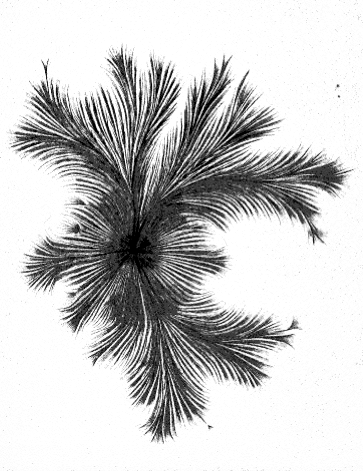

# could we get an image to flow like effluvium?

The chemistry of Edward Weston's photographs used metal salts to stain paper. The salts were activated by light and then amplified by chemistry. Could you make that image without light or optics? How would it be distorted by liquid flows, effluvial plasmas, and electrical discharge? How would you make an image without pictures? Would they feature sheer effluvial distortions or bear the mark of electrical discharge?

Try building an image plasma that can interact with film (or sensors). Remove the optical layer and use the flowy electicity to produce an image on the film. 

Consider these images of electricity. Trouvelot found that substituting a photographic plate (emulsion side in contact with an electrode) for Lichtenberg’s insulating plate allowed him to produce “Lichtenberg figures” on the developed photograph. Thus, these photographs of his became known as “Trouvelot figures.”

Étienne-Léopold Trouvelot, Direct electric spark obtained with a Ruhmkorff coil or Wimshurst machine, also known as “Trouvelot Figure.” photograph, ca. 1888-89 (© [Musée des arts et métiers](http://www.arts-et-metiers.net/), Conservatoire national des arts et métiers, Paris) 

